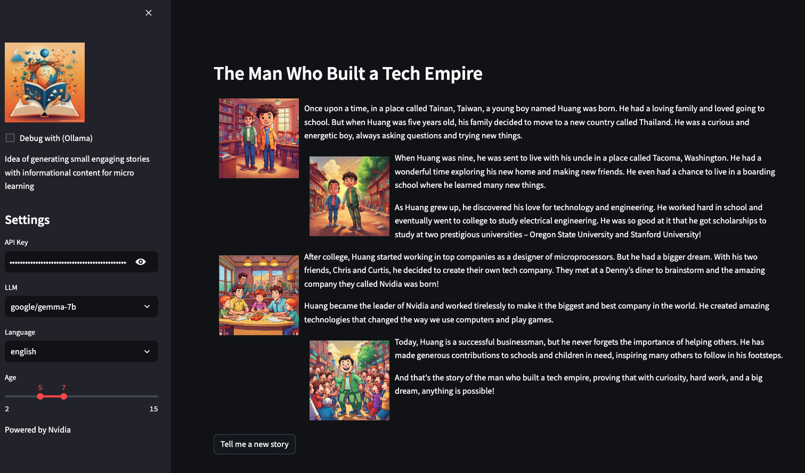
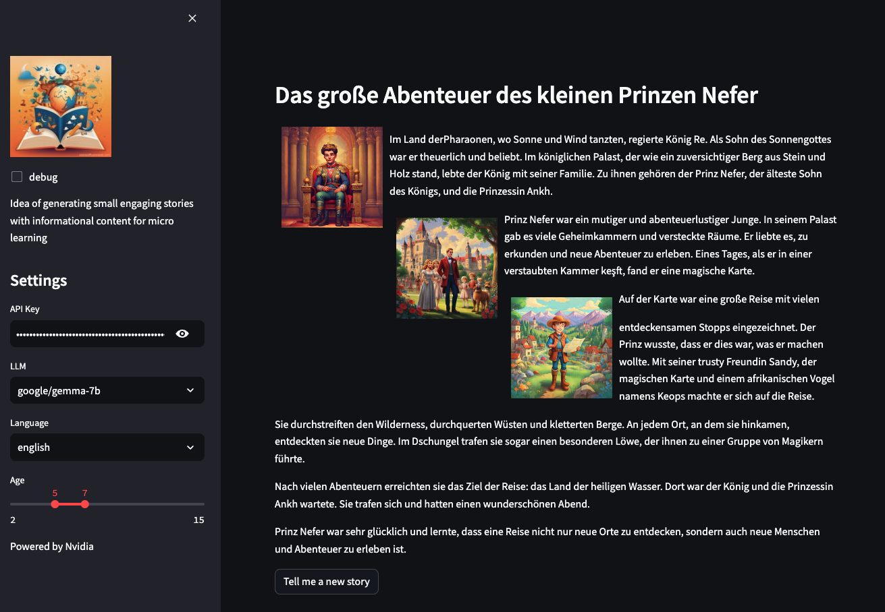
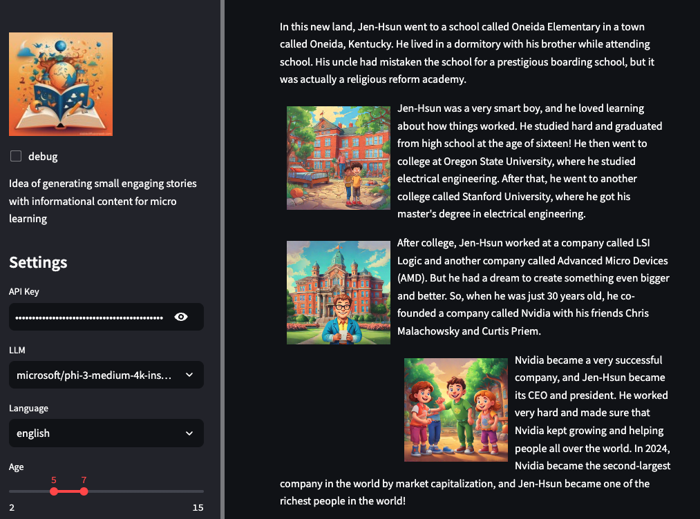

# LearnTales


Imagine a world where learning is an adventure, where stories come alive and transform complex information into enchanting experiences. Welcome to Learn Tales, the revolutionary software designed to generate joyful, immersive stories that make learning an absolute delight for children"


## Getting started

```python
poetry install
python -m streamlit run ./lit/main.py

```

## Features
* Dynamic Story Generation based on year of audience
* Selection of two languages
* Selection of different models for generating stories
* Combination of text and image generation

## Preview / Samples




## Outlook
* Educational integration
* Fine-tuned stories with interaction and videos (including drill-down)
* ...
